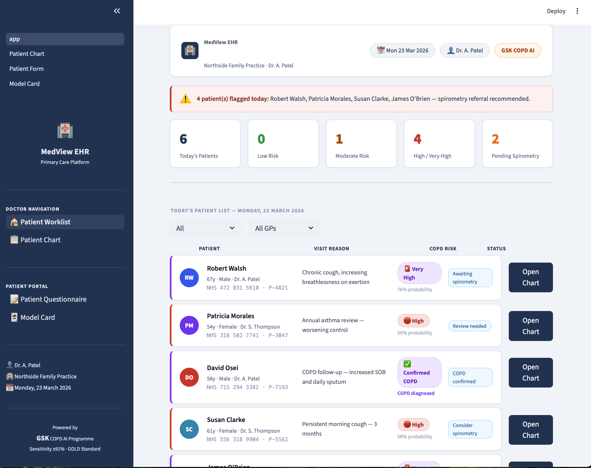
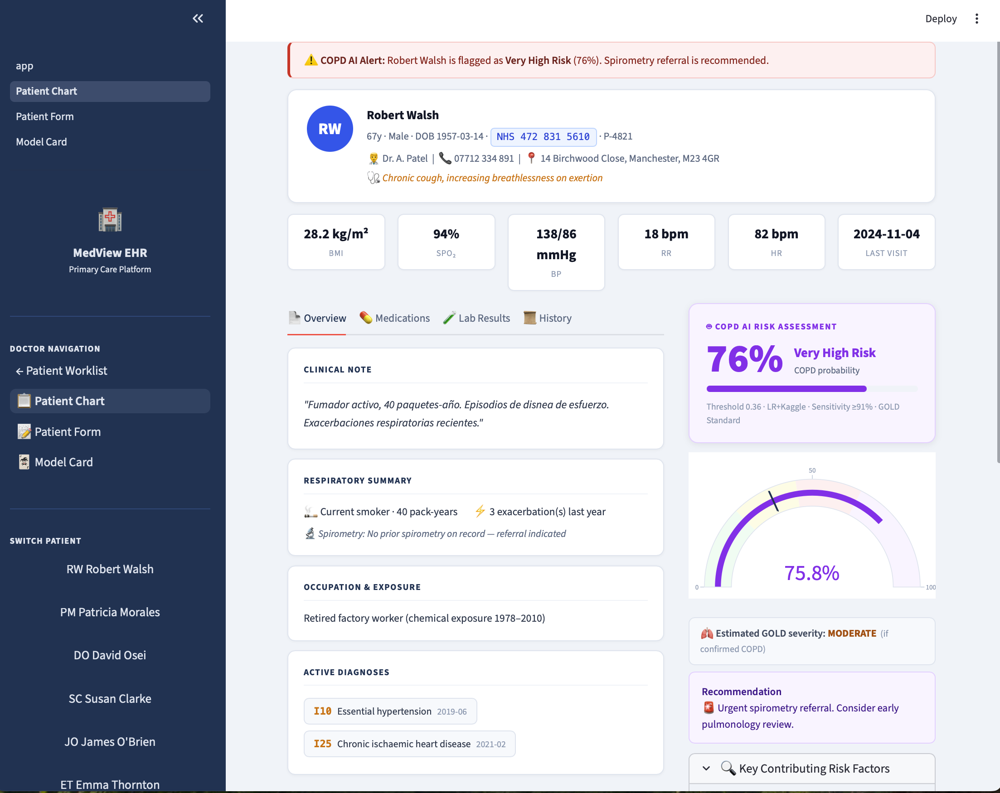
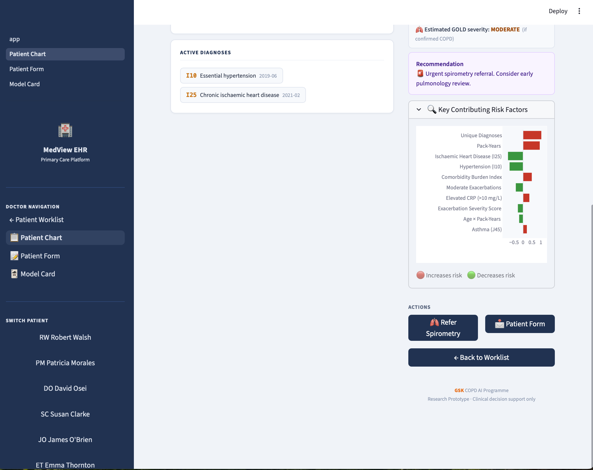
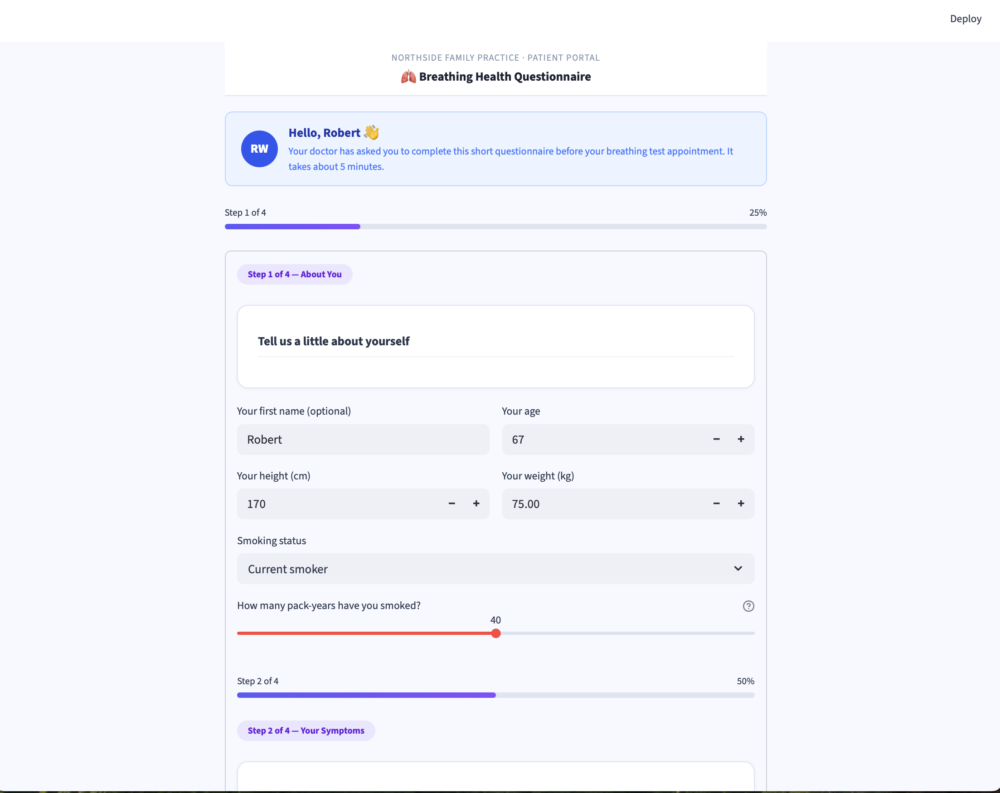
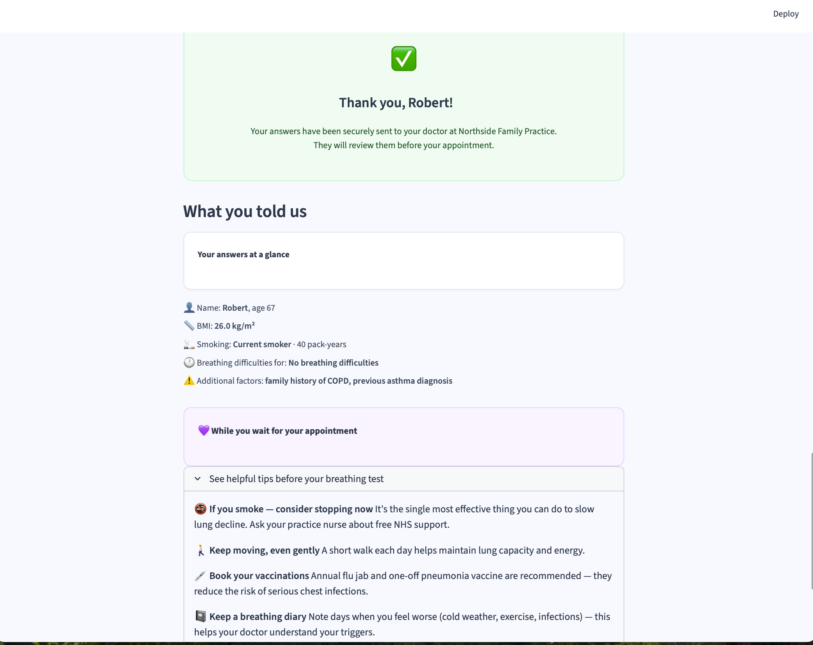

# COPD Screener

An AI tool that helps family doctors identify patients at risk of COPD before spirometry.

---

## How to run it

### Step 1 — Make sure you have Python

Open **Terminal** (Mac) or **Command Prompt** (Windows) and type:
```
python3 --version
```
If you see a version number like `Python 3.12.0` you're good. If not, download Python from [python.org](https://www.python.org/downloads/) and install it, then come back here.

---

### Step 2 — Download the project

Click the green **Code** button at the top of this GitHub page → **Download ZIP** → unzip it somewhere on your computer (e.g. your Desktop).

---

### Step 3 — Install the required packages

In Terminal, navigate to the unzipped folder:
```
cd ~/Desktop/COPD-prediction-main
```
> If you saved it somewhere else, replace the path above accordingly.

Then run:
```
pip3 install -r requirements.txt
```
This takes 1–2 minutes. You only need to do it once.

---

### Step 4 — Start the app

```
python3 -m streamlit run app.py
```

Your browser will open automatically at **http://localhost:8501**. That's it — no further setup needed.

To stop the app, press `Ctrl + C` in the Terminal.

---

## What you'll see

| Page | What it does |
|------|-------------|
| **Worklist** | Today's patients with colour-coded COPD risk badges |
| **Patient Chart** | Full clinical view with AI risk score and explanation |
| **Patient Form** | Patient-facing symptom questionnaire (no medical jargon) |
| **Model Card** | How the AI works, its accuracy, and its limitations |

---

## Screenshots

**Doctor worklist** — patients colour-coded by COPD risk, confirmed diagnoses clearly labelled


**Patient chart** — AI risk score, gauge, GOLD severity estimate and recommendation


**Key contributing risk factors** — shows which clinical features are driving the score


**Patient questionnaire** — sent to the patient before their appointment, no medical jargon


**Questionnaire confirmation** — patient summary with health tips while they wait


---

## Quick demo walkthrough

1. You'll land on the **doctor worklist** — 6 demo patients with risk levels
2. Click **Open Chart** on any patient
3. On flagged patients, click **📩 Send Patient Form** to open the patient questionnaire
4. After the form is submitted, the risk score on the chart updates automatically
5. Use the **sidebar** to switch between pages

---

## Troubleshooting

**"Port already in use" error**
```
pkill -f streamlit
```
Then start the app again.

**"Module not found" error**
```
pip3 install -r requirements.txt
```

**Browser didn't open automatically**
Go to [http://localhost:8501](http://localhost:8501) manually.

---

> **Note:** This is a research prototype for demo purposes only. Not approved for clinical use.
